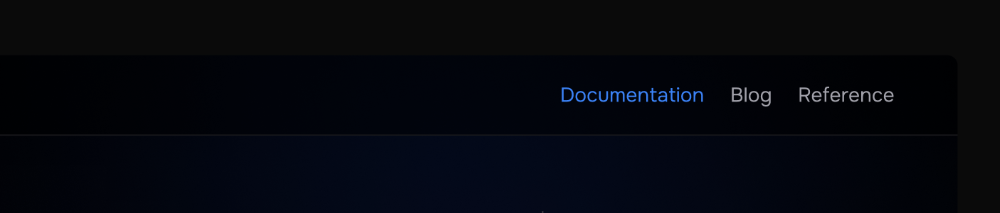
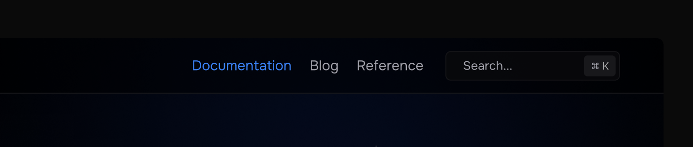
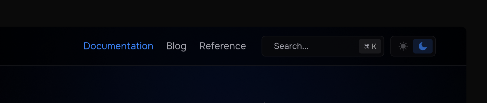
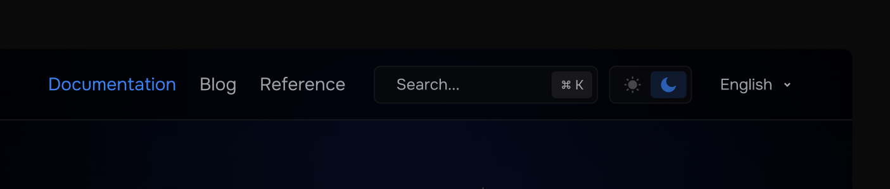

# Options

Glagolica is not a tool that's leaned towards certain ecosystem,
therefore it does not provide programmatic way of setting certain configuration options via scripting languages.

We use TOML for our configuration, see [Config Lookup](./lookup.md) for more information regarding where to store config.

## `[interface]`

This section documents overall looks of documentation.

### `default_lang`

Default language for your documentation is `"en"`,
but you're free to modify the value based on [ISO 639](https://en.wikipedia.org/wiki/List_of_ISO_639_language_codes):

```toml
[interface]
default_lang = "en-US"
```

### `title`

Title value represents name of your documentation, not the Metadata.
Setting the value to some string would change some parts of your site and PDF,
including header and footer.

When serving web version of your documentation,
Glagolica will use this value in site's title based on `title_template`.

```toml
[interface]
title = "This Documentation"
```

### `title_template`

To serve dynamic site metadata title, we use string template.

Following variables represent some values:

- `%name` - Name of the page AKA `title` value for frontmatter.
- `%title` - Title of the documentation, see above.

Default value is `"%name | %title"`.

```toml
[interface]
title_template = "%name -.- %title"
```

### `home_page`

Path to your markdown file representing home/landing page relative to config file.

Defaults value is `"./README.md"`.

```toml
[interface]
home_page = "./src/docs/main.md"
```

## `[references]`

For smaller projects with single repository or the ones that use monorepository, this option is useless.

But for cases when you need to generate reference documentation of comments from different repositories for single monolithic documentation,
you can define list of git repositories to fetch when serving documentation:

```toml
[references]
markdown-ast = { git = "https://github.com/glagolica/markdown.git" }

# You can change branch
frontend = { git = "https://github.com/glagolica/frontend.git", branch = "next" }

# You can separate references in monorepo with path
server = { git = "https://github.com/glagolica/glagolica.git", path = "./server" }
cli = { git = "https://github.com/glagolica/glagolica.git", path = "./glag" }
```

> [!NOTE]
> Name of the repository e.g. `markdown-ast`, `frontend`, `server`, `cli` will be used as part of links: `/en-US/reference/markdown-ast`, `/reference/frontend` etc.

## `[header]`

This section documents modification of web header, it has nothing to do with PDF generation.

By default, Glagolica comes with only 1 sublink in header: `Documentation`.
It's a link that forwards to first possible documentation page in sidebar.

Additionally there can be 2 more sublinks that appear when you integrate your blog and language reference: `Blog` and `Reference` correspondingly:



> [!NOTE]
> // TODO document blog and reference integration

### `search_bar`

To improve a11y, we offer own search engine to search in documentation.
By setting `search_bar` option to `true`,
your documentation will automatically include search bar as a header widget:



This option is set to `true` by default:

```toml
[header]
search_bar = true
```

### `theme_mode`

This option defines which theme mode (light or dark) to use by default and whether to show toggle or not.

It takes 3 of the following values: `"light"`, `"dark"` and `"auto"`.

By setting this option to either `"light"` or `"dark"`,
Glagolica will remove theme mode toggle widget from header.

Otherwise, if you set the option to `"auto"`,
Glagolica will automatically determine color scheme preference of user and use corresponding theme mode:

```toml
[header]
theme_mode = "auto" # "light" or "dark"
```



<!--
To make Glagolica's UI experience as good as possible, we offer theme customization.

Right now it is limited to 2 options, but soon we will improve the whole visual look and theme customization altogether.
-->

### `languages`

By default, Glagolica checks if there is more than 1 language existing in your documentation repository.

If there are no suffixes specified within your markdown file names,
then `languages` setting would be set to `false`, otherwise `true`.
This option would add a widget for language dropdown:

```toml
[header]
languages = true # or false
```



Glagolica comes with a limited dictionary of ISO-639 endonyms.

If your documentation is translated to German, using `de` language code,
then Glagolica would automatically append "Deutsch" in the list of languages.

> [!NOTE]
> To know more about our dictionary of endonyms, see here. // TODO add dictionary

However, in some cases if you want to add another language that's not listed in dictionary or override existing one,
you can use `languages` option as a dictionary with Key-Value fields as Code-Endonym:

```toml
[header.languages]
en = "English"
de = "Deutsch"
ru = "Русский"
```

Having this languages listed as addition to existing dictionary does not mean it will pop up in the list of languages.
For these languages to appear in dropdown, you should have a page translated to one of the languages.
